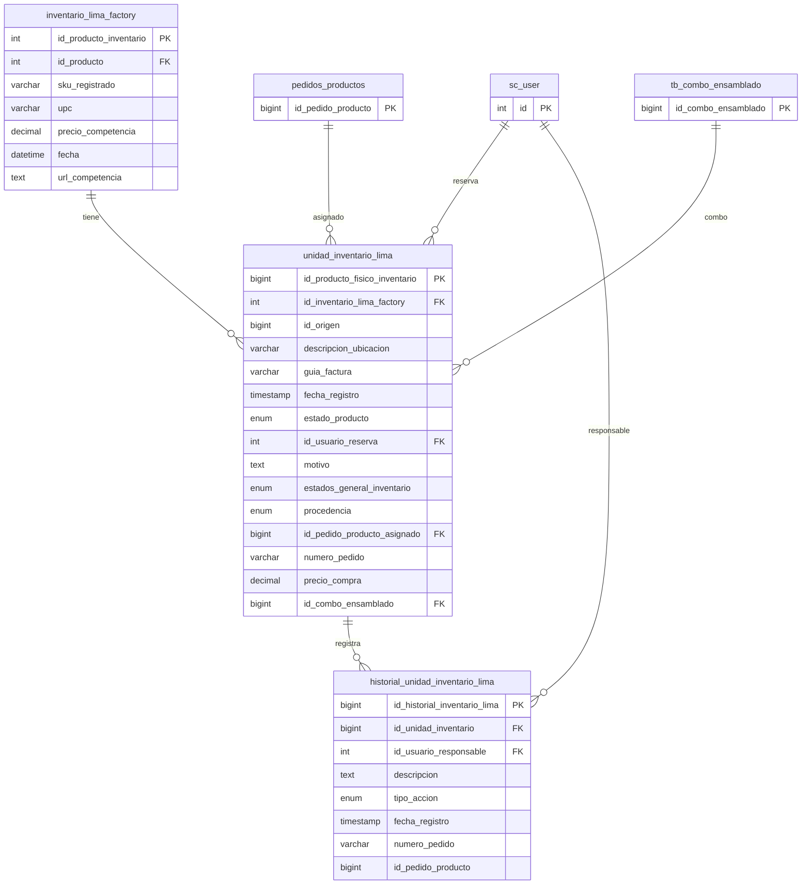

## Tablas
#### Inventario Lima Factory
Inventario lima factory seria como aquel que guarda los sku de productos y referencias de 'id' de la tabla productos para luego usar esa relación para mostrar imágenes y nombres de productos.

```sql
create table inventario_lima_factory  
(  
    id_producto_inventario int auto_increment  primary key,  
    id_producto            int            not null,  -- tabla productos
    sku_registrado         varchar(255)   not null,  -- tabla prodcutos 
    upc                    varchar(100)   null,-- upc del producto  
    precio_competencia     decimal(16, 3) null,-- era para una feature que no se uso  de mercado libre
    fecha                  datetime       null,-- fecha de registro  
    url_competencia        text           null-- era para una feature que no se uso  de mercado libre
);  
  
create index idx_inventario_lima_factory_id_producto  
    on inventario_lima_factory (id_producto);  
  
create index idx_inventario_lima_factory_sku  
    on inventario_lima_factory (sku_registrado);
```

---
#### Unidad de Inventario Lima
Esta es la tabla que guarda cada instancia de un producto, por que un producto puede tener N unidades registradas esto permite trabajar a nivel granular cada unidad.

- id_origen : id de la unidad de usa al cual hace referencia
- id_combo_ensamblado: id de la tabla de combos para saber con que unidades fue formada esta unidad de un producto de que por si es un combo


```sql
create table unidad_inventario_lima
(
    id_producto_fisico_inventario   bigint unsigned auto_increment
        primary key,
    id_inventario_lima_factory      int                                                                                                                    not null,
    id_origen                       bigint unsigned                                                                                                       null,
    descripcion_ubicacion           varchar(500)                                                                                                           null,
    guia_factura                    varchar(100)                                                                                                           null,
    fecha_registro                  timestamp default CURRENT_TIMESTAMP                                                                                    null,
    estado_producto                 enum ('nuevo', 'open_box', 'caja_golpeada', 'sin_empaque_original')                                                    null,
    id_usuario_reserva              int                                                                                                                    null,
    motivo                          text                                                                                                                   null,
    estados_general_inventario_lima enum ('disponible', 'reservado', 'en_pedido', 'otro', 'inutilizable', 'en_tecnico', 'para_tecnico', 'merma', 'combos') null,
    procedencia                     enum ('pedido', 'inventario_usa', 'compra_peru', 'pedido_erroneo', 'pedido_erroneo_proveedor', 'libre', 'ensamblado')  null,
    id_pedido_producto_asignado     bigint unsigned                                                                                                        null,
    numero_pedido                   varchar(100)                                                                                                           null,
    precio_compra                   decimal(16, 4)                                                                                                         null,
    numero_pedido_origen            varchar(100)                                                                                                           null,
    id_combo_ensamblado             bigint unsigned                                                                                                        null,
    constraint fk_uil_combo_ensamblado
        foreign key (id_combo_ensamblado) references tb_combo_ensamblado (id_combo_ensamblado),
    constraint unidad_inventario_lima_ibfk_1
        foreign key (id_inventario_lima_factory) references inventario_lima_factory (id_producto_inventario),
    constraint unidad_inventario_lima_ibfk_2
        foreign key (id_usuario_reserva) references sc_user (id),
    constraint unidad_inventario_lima_ibfk_3
        foreign key (id_pedido_producto_asignado) references pedidos_productos (id_pedido_producto)
);

create index id_inventario_lima_factory
    on unidad_inventario_lima (id_inventario_lima_factory);

create index id_pedido_producto_asignado
    on unidad_inventario_lima (id_pedido_producto_asignado);

create index id_usuario_reserva
    on unidad_inventario_lima (id_usuario_reserva);
```

---
#### Historial Unidad Lima
Historial de acciones que ocurrieron a una unidad de lima
```sql
create table historial_unidad_inventario_lima  
(  
    id_historial_inventario_lima bigint unsigned auto_increment  
        primary key,  
    id_unidad_inventario         bigint unsigned                        null,  
    id_usuario_responsable       int                                    null,  
    descripcion                  text                                   null,  
    tipo_accion                  enum ('entrada', 'salida', 'sin_tipo') null,  
    fecha_registro               timestamp default CURRENT_TIMESTAMP    null,  
    numero_pedido                varchar(100)                           null,  
    id_pedido_producto           bigint unsigned                        null,  
    constraint historial_unidad_inventario_lima_ibfk_1  
        foreign key (id_usuario_responsable) references sc_user (id),  
    constraint historial_unidad_inventario_lima_ibfk_2  
        foreign key (id_unidad_inventario) references unidad_inventario_lima (id_producto_fisico_inventario)  
);  
  
create index id_unidad_inventario  
    on historial_unidad_inventario_lima (id_unidad_inventario);  
  
create index id_usuario_responsable  
    on historial_unidad_inventario_lima (id_usuario_responsable);
```

## Diagrama de Tablas



# Store Procedures de Lima

Índice — clic en cada SP para saltar a su documentación

| **FUNCIÓN**                                               | NOMBRE STORE PROCEDURE                              | LEGACY / NOW |
| --------------------------------------------------------- | --------------------------------------------------- | ------------ |
| Registrar unidades de productos en inventario Lima        | [[sp_registrar_inventario_lima]]                    | **NOW**      |
| Listado de pedidos productos de un pedido                 | [[sp_listar_pedido_productos_para_lima]]            | **NOW**      |
| Obtener inventario Lima (paginado)                        | [[SP_get_inventario_lima]]                          | **NOW**      |
| Obtener unidades de inventario Lima (paginado)            | [[sp_get_unidades_inventario_lima]]                 | **LEGACY**   |
| Cambiar precio y ubicación de un producto                 | [[sp_cambiar_precio_ubicacion]]                     | **NOW**      |
| Reservar un producto de Lima                              | [[sp_reservar_producto]]                            |              |
| Desreservar un producto de Lima                           | [[sp_desreservar_producto]]                         |              |
| Asignar unidad Lima a un pedido                           | [[sp_asignar_unidad_lima_a_pedido]]                 |              |
| Listar historial de una unidad Lima                       | [[sp_listar_historial_unidad_lima]]                 |              |
| Obtener producto de inventario Lima por ID                | [[SP_get_inventario_lima_by_id]]                    |              |
| Historial de unidades de inventario Lima (paginado)       | [[sp_listar_historial_unidades_lima]]               |              |
| Cantidades por estado del producto de unidades Lima       | [[sp_cantidades_por_estado_producto_unidades_lima]] |              |
| Cantidades por estado de inventario Lima por producto     | [[sp_get_cantidades_estados_inventario_lima]]       |              |
| Exportar movimientos de Lima a Excel                      | [[sp_exportar_movimientos_lima]]                    |              |
| Listar IDs de unidades de un producto (excluye en_pedido) | [[SP_listar_id_unidades_productos_inventario_lima]] |              |
| Actualizar UPC de un producto en inventario Lima          | [[SP_actualizar_upc_inventario_lima]]               |              |
| Asignar precio de compra a unidades Lima                  | [[sp_asignar_precio_compra_unidades_lima]]          |              |
| Obtener unidades en estado "nuevo"                        | [[sp_get_unidades_nuevas]]                          |              |
| Obtener unidades en estado "open box"                     | [[sp_get_unidades_open_box]]                        |              |
| Obtener unidades en estado "caja golpeada"                | [[sp_get_unidades_caja_golpeada]]                   |              |
| Obtener unidades "sin empaque original"                   | [[sp_get_unidades_sin_empaque_original]]            |              |
| Exportar unidades Lima disponibles a Excel                | [[sp_exportar_unidades_lima_para_excel]]            |              |
| Registrar publicaciones MELI (desde Excel)                | [[sp_registrar_publicaciones_meli]]                 |              |
| Registrar configuración WEB de un producto                | [[sp_registrar_config_web_lima]]                    |              |
| Actualizar configuración de publicación (MELI/WEB)        | [[sp_actualizar_config_publicacion_lima]]           |              |
| Obtener unidad escaneada Lima                             | [[SP_get_unidad_escaneada_lima]]                    |              |
| Obtener pedidos para asignación de Lima por SKU           | [[sp_get_pedidos_para_asignacion_de_lima]]          |              |
| Cambiar estado de una unidad Lima                         | [[sp_cambiar_estado_unidad_lima]]                   |              |
| Obtener unidades en técnico                               | [[sp_get_unidades_en_tecnico_lima]]                 |              |
| Obtener unidades en merma                                 | [[sp_get_unidades_merma_lima]]                      |              |
| Cambiar SKU de una unidad Lima                            | [[sp_cambiar_sku_unidad_lima]]                      |              |
| Exportar stock Lima para ecommerce                        | [[sp_exportar_stock_lima_ecommerce]]                |              |
